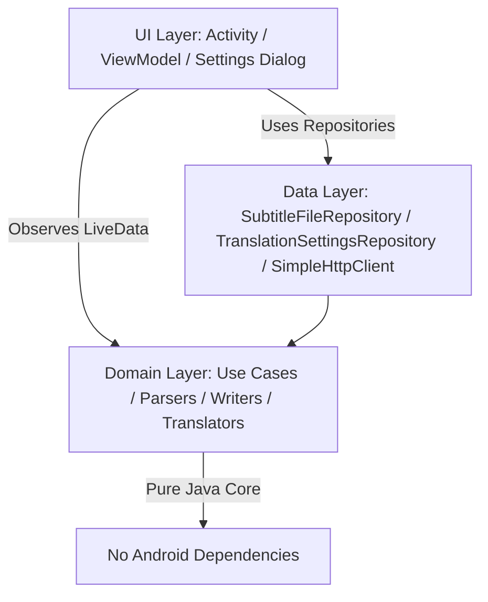

# Vtt2Srt — WebVTT to SubRip (SRT) Converter & AI Translator

[](https://developer.android.com)
[](https://www.oracle.com/java/)
[-blue.svg)](https://developer.android.com/about/versions/nougat)
[](https://developer.android.com)
[](https://developer.android.com/topic/architecture)

**Vtt2Srt** is a modern native Android application built in Java that converts WebVTT (`.vtt`) subtitle files into standard SubRip (`.srt`) format. It features a flexible, multi-provider AI translation engine supporting **Google Gemini AI**, **DeepSeek AI**, **Anthropic Claude AI**, and **Custom OpenAI / Local LLM endpoints**, alongside a fallback free web translation pipeline.

---

## 📱 Features

- 📑 **Robust WebVTT Parser**: Correctly parses WebVTT files handling Byte Order Marks (BOM), `\r\n` line breaks, optional cue identifiers, timestamp variations (with or without hours), `NOTE`/`STYLE`/`REGION` blocks, voice tags (`<v SpeakerName>`), inline formatting (`<i>`, `<c.x>`, inline timestamps), and HTML entities.
- ⏱️ **SubRip (`.srt`) Formatting**: Outputs fully compliant SRT subtitle files with 1-based sequential indices and standard timestamp formats (`HH:MM:SS,mmm`).
- 🤖 **AI Translation Engine**: Support for multiple AI models with custom API keys, model selection, custom endpoints, and custom system prompts:
  - **Google Gemini AI** (`gemini-1.5-flash`, `gemini-2.0-flash`, etc.)
  - **DeepSeek AI** (`deepseek-chat`, `deepseek-reasoner`)
  - **Anthropic Claude AI** (`claude-3-5-haiku`, etc.)
  - **Custom OpenAI / Local LLM** (OpenAI proxies, Ollama, vLLM, local endpoints)
- 🌐 **Free Web Fallback Pipeline**: Uses Google Translate and MyMemory automatically as fallback when free web mode is active or as backup.
- ⏱️ **Concurrent Processing**: Translates subtitle cues in parallel using multi-threaded execution (`ExecutorService`), reporting real-time progress updates with an animated progress indicator and cancellation support.
- 🇸🇦 **Arabic RTL & Bilingual Customization**:
  - **RTL Fix**: Prepends Right-to-Left Mark (`\u200F`) unicode characters to lines to ensure punctuation renders accurately in video players.
  - **Bilingual Subtitles**: Generates dual-language subtitles (Arabic translation + original text formatted in italics).
  - **Speaker Preservation**: Option to retain speaker names (`Speaker: text`) during conversion and translation.
- 🎨 **Modern Material 3 UI**: Material 3 styling, Edge-to-Edge display support, custom font, and dual English & Arabic localization.
- 📂 **Storage Access Framework (SAF)**: Uses Android system file pickers for secure document reading and saving without needing broad storage permissions.

---

## 🏛️ Architecture & Design Patterns

The project strictly adheres to **SOLID** principles, **Clean Architecture**, and **GoF Design Patterns**:



### SOLID Principles Compliance
- **Single Responsibility Principle (SRP)**: Each class has a single, well-defined purpose (e.g., `GeminiTranslator` handles Gemini API parsing, `TranslationSettingsRepository` manages settings persistence).
- **Open-Closed Principle (OCP)**: New AI engines or translators can be added by implementing `Translator` without modifying existing translation code or `TranslateSubtitlesUseCase`.
- **Liskov Substitution Principle (LSP)**: All AI and web translator implementations (`GeminiTranslator`, `ClaudeTranslator`, `OpenAiCompatibleTranslator`, `GoogleTranslator`) implement `Translator` and are interchangeable.
- **Interface Segregation Principle (ISP)**: Focused interfaces (`Translator`, `ProgressListener`).
- **Dependency Inversion Principle (DIP)**: `TranslateSubtitlesUseCase` and `TranslatorFactory` depend on abstract interfaces (`Translator`) rather than concrete details.

---

### Software Design Patterns Utilized

| Pattern | Class / Interface | Description |
| :--- | :--- | :--- |
| **Strategy** | [`Translator`](file:///D:/Workspace/IDE/IdeaProjects/Vtt2Srt/app/src/main/java/com/subtitle/vtt2srt/domain/translate/Translator.java) | Allows swapping translation engines ([`GeminiTranslator`](file:///D:/Workspace/IDE/IdeaProjects/Vtt2Srt/app/src/main/java/com/subtitle/vtt2srt/domain/translate/GeminiTranslator.java), [`ClaudeTranslator`](file:///D:/Workspace/IDE/IdeaProjects/Vtt2Srt/app/src/main/java/com/subtitle/vtt2srt/domain/translate/ClaudeTranslator.java), [`OpenAiCompatibleTranslator`](file:///D:/Workspace/IDE/IdeaProjects/Vtt2Srt/app/src/main/java/com/subtitle/vtt2srt/domain/translate/OpenAiCompatibleTranslator.java), [`GoogleTranslator`](file:///D:/Workspace/IDE/IdeaProjects/Vtt2Srt/app/src/main/java/com/subtitle/vtt2srt/domain/translate/GoogleTranslator.java)) transparently. |
| **Decorator** | [`CachingTranslator`](file:///D:/Workspace/IDE/IdeaProjects/Vtt2Srt/app/src/main/java/com/subtitle/vtt2srt/domain/translate/CachingTranslator.java), [`RetryingTranslator`](file:///D:/Workspace/IDE/IdeaProjects/Vtt2Srt/app/src/main/java/com/subtitle/vtt2srt/domain/translate/RetryingTranslator.java) | Decorates translators with thread-safe caching and retry abilities. |
| **Chain of Responsibility** | [`FallbackTranslator`](file:///D:/Workspace/IDE/IdeaProjects/Vtt2Srt/app/src/main/java/com/subtitle/vtt2srt/domain/translate/FallbackTranslator.java) | Tries the primary AI engine first; if errors occur, falls back to backup providers. |
| **Factory** | [`TranslatorFactory`](file:///D:/Workspace/IDE/IdeaProjects/Vtt2Srt/app/src/main/java/com/subtitle/vtt2srt/domain/translate/TranslatorFactory.java) | Assembles the complete resilient translator pipeline based on user configuration (`Cache` -> `Fallback` -> `Retrying(AI/Free)`). |
| **Builder** | [`ConversionOptions.Builder`](file:///D:/Workspace/IDE/IdeaProjects/Vtt2Srt/app/src/main/java/com/subtitle/vtt2srt/domain/model/ConversionOptions.java), [`AiTranslatorConfig.Builder`](file:///D:/Workspace/IDE/IdeaProjects/Vtt2Srt/app/src/main/java/com/subtitle/vtt2srt/domain/translate/AiTranslatorConfig.java) | Provides fluent, immutable configuration construction. |
| **Observer** | `LiveData` / `Observer` | Connects domain/viewmodel state updates asynchronously to the user interface. |

---

## 🛠️ Translation Resiliency Pipeline

```
[ Translate Cues Call ]
          │
          ▼
┌──────────────────┐
│ CachingTranslator│ ── (Hit?) ──> [ Return Cached Translation ]
└────────┬─────────┘
         │ (Miss)
         ▼
┌──────────────────────────────────────────────┐
│ FallbackTranslator                           │
└────────┬─────────────────────────────────────┘
         ├─► [ RetryingTranslator (AI Engine: Gemini/Claude/DeepSeek/OpenAI) ]
         │         │
         │     (Failed)
         │         ▼
         └─► [ RetryingTranslator (Free Web Fallback Engine) ]
```

---

## 📁 Project Structure

```
app/src/main/java/com/subtitle/vtt2srt/
├── data/
│   ├── SimpleHttpClient.java
│   ├── SubtitleFileRepository.java
│   └── TranslationSettingsRepository.java
├── domain/
│   ├── model/
│   │   ├── ConversionOptions.java
│   │   └── SubtitleCue.java
│   ├── parser/
│   │   ├── SubtitleParseException.java
│   │   ├── SubtitleParser.java
│   │   └── VttParser.java
│   ├── translate/
│   │   ├── AiTranslatorConfig.java
│   │   ├── CachingTranslator.java
│   │   ├── ClaudeTranslator.java
│   │   ├── FallbackTranslator.java
│   │   ├── GeminiTranslator.java
│   │   ├── GoogleTranslator.java
│   │   ├── MyMemoryTranslator.java
│   │   ├── OpenAiCompatibleTranslator.java
│   │   ├── RetryingTranslator.java
│   │   ├── TranslationEngineType.java
│   │   ├── TranslationException.java
│   │   ├── Translator.java
│   │   └── TranslatorFactory.java
│   ├── usecase/
│   │   └── TranslateSubtitlesUseCase.java
│   └── writer/
│       ├── SrtWriter.java
│       └── SubtitleWriter.java
├── ui/
│   ├── CueAdapter.java
│   ├── MainActivity.java
│   └── MainViewModel.java
└── util/
    ├── Event.java
    ├── NetworkChecker.java
    ├── TimeFormatter.java
    └── UI.java
```

---

## 🚀 Building & Running

### Prerequisites
- **Android Studio**: Koala (2024.1.1) or newer recommended.
- **JDK**: Java 21 configured in IDE.
- **Android Device / Emulator**: Running Android 7.0 (API Level 24) or higher.

---

## 🧪 Testing

The domain logic is fully unit-tested with JUnit 4 to verify WebVTT parsing, timestamp calculation, SRT output formatting, AI configuration parameters, RTL unicode insertion, and translation error handling.

To run tests:
```bash
./gradlew test
```

---

## 📄 License

This project is open-source and available under the standard project terms.
