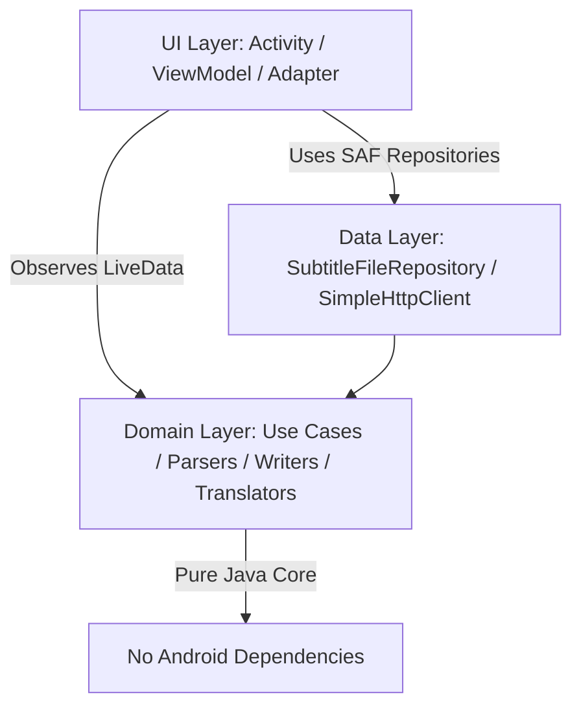

# Vtt2Srt — WebVTT to SubRip (SRT) Converter & Translator

[](https://developer.android.com)
[](https://www.oracle.com/java/)
[-blue.svg)](https://developer.android.com/about/versions/nougat)
[](https://developer.android.com)
[](https://developer.android.com/topic/architecture)

**Vtt2Srt** is a modern native Android application built in Java that converts WebVTT (`.vtt`) subtitle files into standard SubRip (`.srt`) format. In addition to file conversion, it features a concurrent, resilient online translation engine that translates subtitles into Arabic with options for bilingual outputs, speaker attribution retention, and RTL text formatting.

---

## 📱 Features

- 📑 **Robust WebVTT Parser**: Correctly parses WebVTT files handling Byte Order Marks (BOM), `\r\n` line breaks, optional cue identifiers, timestamp variations (with or without hours), `NOTE`/`STYLE`/`REGION` blocks, voice tags (`<v SpeakerName>`), inline formatting (`<i>`, `<c.x>`, inline timestamps), and HTML entities.
- ⏱️ **SubRip (`.srt`) Formatting**: Outputs fully compliant SRT subtitle files with 1-based sequential indices and standard timestamp formats (`HH:MM:SS,mmm`).
- 🌐 **Concurrent Translation Engine**: Translates subtitle cues in parallel using multi-threaded execution (`ExecutorService`), reporting real-time progress updates and offering full cancellation support.
- 🛡️ **Fault-Tolerant Translator Pipeline**: Combines multiple translation providers with automated retry strategy, fallback mechanics, and memory caching.
- 🇸🇦 **Arabic RTL & Bilingual Customization**:
  - **RTL Fix**: Prepends Right-to-Left Mark (`\u200F`) unicode characters to lines to ensure punctuation renders accurately in video players.
  - **Bilingual Subtitles**: Generates dual-language subtitles (Arabic translation + original text formatted in italics).
  - **Speaker Preservation**: Option to retain speaker names (`Speaker: text`) during conversion and translation.
- 🎨 **Modern Android UI**: Built with Material Design 3, ViewBinding, Edge-to-Edge display support, and System Window Insets handling for smooth layout responsiveness.
- 📂 **Storage Access Framework (SAF)**: Uses Android system file pickers for secure document reading and saving without needing broad storage permissions.

---

## 🏛️ Architecture & Design Patterns

The project strictly follows **Clean Architecture** principles decoupled into distinct layers, ensuring high testability and maintainability:



### Clean Architecture Layers
1. **Domain (`com.subtitle.vtt2srt.domain`)**:
   - Contains pure Java domain logic independent of any Android framework dependencies.
   - Includes data models ([`SubtitleCue`](file:///D:/Workspace/IDE/IdeaProjects/Vtt2Srt/app/src/main/java/com/subtitle/vtt2srt/domain/model/SubtitleCue.java), [`ConversionOptions`](file:///D:/Workspace/IDE/IdeaProjects/Vtt2Srt/app/src/main/java/com/subtitle/vtt2srt/domain/model/ConversionOptions.java)), parser contracts ([`SubtitleParser`](file:///D:/Workspace/IDE/IdeaProjects/Vtt2Srt/app/src/main/java/com/subtitle/vtt2srt/domain/parser/SubtitleParser.java), [`VttParser`](file:///D:/Workspace/IDE/IdeaProjects/Vtt2Srt/app/src/main/java/com/subtitle/vtt2srt/domain/parser/VttParser.java)), writers ([`SrtWriter`](file:///D:/Workspace/IDE/IdeaProjects/Vtt2Srt/app/src/main/java/com/subtitle/vtt2srt/domain/writer/SrtWriter.java)), translation interfaces ([`Translator`](file:///D:/Workspace/IDE/IdeaProjects/Vtt2Srt/app/src/main/java/com/subtitle/vtt2srt/domain/translate/Translator.java)), and use cases ([`TranslateSubtitlesUseCase`](file:///D:/Workspace/IDE/IdeaProjects/Vtt2Srt/app/src/main/java/com/subtitle/vtt2srt/domain/usecase/TranslateSubtitlesUseCase.java)).
2. **Data (`com.subtitle.vtt2srt.data`)**:
   - Handles file I/O operations via ContentResolver ([`SubtitleFileRepository`](file:///D:/Workspace/IDE/IdeaProjects/Vtt2Srt/app/src/main/java/com/subtitle/vtt2srt/data/SubtitleFileRepository.java)) and network HTTP requests ([`SimpleHttpClient`](file:///D:/Workspace/IDE/IdeaProjects/Vtt2Srt/app/src/main/java/com/subtitle/vtt2srt/data/SimpleHttpClient.java)).
3. **UI (`com.subtitle.vtt2srt.ui`)**:
   - Follows the MVVM pattern with Android [`MainViewModel`](file:///D:/Workspace/IDE/IdeaProjects/Vtt2Srt/app/src/main/java/com/subtitle/vtt2srt/ui/MainViewModel.java), [`MainActivity`](file:///D:/Workspace/IDE/IdeaProjects/Vtt2Srt/app/src/main/java/com/subtitle/vtt2srt/ui/MainActivity.java), ViewBinding, and RecyclerView ([`CueAdapter`](file:///D:/Workspace/IDE/IdeaProjects/Vtt2Srt/app/src/main/java/com/subtitle/vtt2srt/ui/CueAdapter.java)).
4. **Util (`com.subtitle.vtt2srt.util`)**:
   - Utility classes for single-time event handling ([`Event`](file:///D:/Workspace/IDE/IdeaProjects/Vtt2Srt/app/src/main/java/com/subtitle/vtt2srt/util/Event.java)), connectivity checks ([`NetworkChecker`](file:///D:/Workspace/IDE/IdeaProjects/Vtt2Srt/app/src/main/java/com/subtitle/vtt2srt/util/NetworkChecker.java)), time conversions ([`TimeFormatter`](file:///D:/Workspace/IDE/IdeaProjects/Vtt2Srt/app/src/main/java/com/subtitle/vtt2srt/util/TimeFormatter.java)), and window inset padding ([`UI`](file:///D:/Workspace/IDE/IdeaProjects/Vtt2Srt/app/src/main/java/com/subtitle/vtt2srt/util/UI.java)).

---

### Software Design Patterns Utilized

| Pattern | Class / Interface | Description |
| :--- | :--- | :--- |
| **Strategy** | [`Translator`](file:///D:/Workspace/IDE/IdeaProjects/Vtt2Srt/app/src/main/java/com/subtitle/vtt2srt/domain/translate/Translator.java) | Allows swapping translation engines ([`GoogleTranslator`](file:///D:/Workspace/IDE/IdeaProjects/Vtt2Srt/app/src/main/java/com/subtitle/vtt2srt/domain/translate/GoogleTranslator.java), [`MyMemoryTranslator`](file:///D:/Workspace/IDE/IdeaProjects/Vtt2Srt/app/src/main/java/com/subtitle/vtt2srt/domain/translate/MyMemoryTranslator.java)) transparently. |
| **Decorator** | [`CachingTranslator`](file:///D:/Workspace/IDE/IdeaProjects/Vtt2Srt/app/src/main/java/com/subtitle/vtt2srt/domain/translate/CachingTranslator.java), [`RetryingTranslator`](file:///D:/Workspace/IDE/IdeaProjects/Vtt2Srt/app/src/main/java/com/subtitle/vtt2srt/domain/translate/RetryingTranslator.java) | Decorates translators with caching and retry abilities without modifying underlying translation implementations. |
| **Chain of Responsibility** | [`FallbackTranslator`](file:///D:/Workspace/IDE/IdeaProjects/Vtt2Srt/app/src/main/java/com/subtitle/vtt2srt/domain/translate/FallbackTranslator.java) | Tries Google Translate first; if requests fail, seamlessly falls back to MyMemory. |
| **Factory** | [`TranslatorFactory`](file:///D:/Workspace/IDE/IdeaProjects/Vtt2Srt/app/src/main/java/com/subtitle/vtt2srt/domain/translate/TranslatorFactory.java) | Assembles the complete resilient translator pipeline (`Cache` -> `Fallback` -> `Retrying(Google)` / `Retrying(MyMemory)`). |
| **Builder** | [`ConversionOptions.Builder`](file:///D:/Workspace/IDE/IdeaProjects/Vtt2Srt/app/src/main/java/com/subtitle/vtt2srt/domain/model/ConversionOptions.java) | Provides fluent configuration of conversion parameters (`translate`, `bilingual`, `keepSpeakers`, `rtlMarks`). |
| **Observer** | `LiveData` / `Observer` | Connects domain/viewmodel state updates asynchronously to the user interface. |

---

## 🛠️ Translation Resiliency Pipeline

```
[ Translate Cues Call ]
          │
          ▼
┌──────────────────┐
│ CachingTranslator│ ── (Hit?) ──> [ Return Cached Translation ]
└────────┬─────────┘
         │ (Miss)
         ▼
┌────────────────────┐
│ FallbackTranslator │
└────────┬───────────┘
         ├─► [ RetryingTranslator (Google Translator) ]
         │         │
         │     (Failed)
         │         ▼
         └─► [ RetryingTranslator (MyMemory Translator) ]
```

---

## 📁 Project Structure

```
app/src/main/java/com/subtitle/vtt2srt/
├── data/
│   ├── SimpleHttpClient.java
│   └── SubtitleFileRepository.java
├── domain/
│   ├── model/
│   │   ├── ConversionOptions.java
│   │   └── SubtitleCue.java
│   ├── parser/
│   │   ├── SubtitleParseException.java
│   │   ├── SubtitleParser.java
│   │   └── VttParser.java
│   ├── translate/
│   │   ├── CachingTranslator.java
│   │   ├── FallbackTranslator.java
│   │   ├── GoogleTranslator.java
│   │   ├── MyMemoryTranslator.java
│   │   ├── RetryingTranslator.java
│   │   ├── TranslationException.java
│   │   ├── Translator.java
│   │   └── TranslatorFactory.java
│   ├── usecase/
│   │   └── TranslateSubtitlesUseCase.java
│   └── writer/
│       ├── SrtWriter.java
│       └── SubtitleWriter.java
├── ui/
│   ├── CueAdapter.java
│   ├── MainActivity.java
│   └── MainViewModel.java
└── util/
    ├── Event.java
    ├── NetworkChecker.java
    ├── TimeFormatter.java
    └── UI.java
```

---

## 🚀 Building & Running

### Prerequisites
- **Android Studio**: Koala (2024.1.1) or newer recommended.
- **JDK**: Java 21 configured in IDE.
- **Android Device / Emulator**: Running Android 7.0 (API Level 24) or higher.

### Steps
1. Clone or open the repository folder in Android Studio:
   ```bash
   git clone https://github.com/your-username/Vtt2Srt.git
   ```
2. Allow Gradle to sync dependencies.
3. Build and execute the project:
   - Select `app` run configuration and target device.
   - Click **Run** (`Shift + F10`).

---

## 🧪 Testing

The domain logic is fully unit-tested with JUnit 4 to verify WebVTT parsing, timestamp calculation, SRT output formatting, RTL unicode insertion, and translation error handling.

To run tests:
```bash
./gradlew test
```
Or right-click [`ConversionTest.java`](file:///D:/Workspace/IDE/IdeaProjects/Vtt2Srt/app/src/test/java/com/subtitle/vtt2srt/ConversionTest.java) in Android Studio and select **Run 'ConversionTest'**.

---

## 📄 License

This project is open-source and available under the standard project terms.
